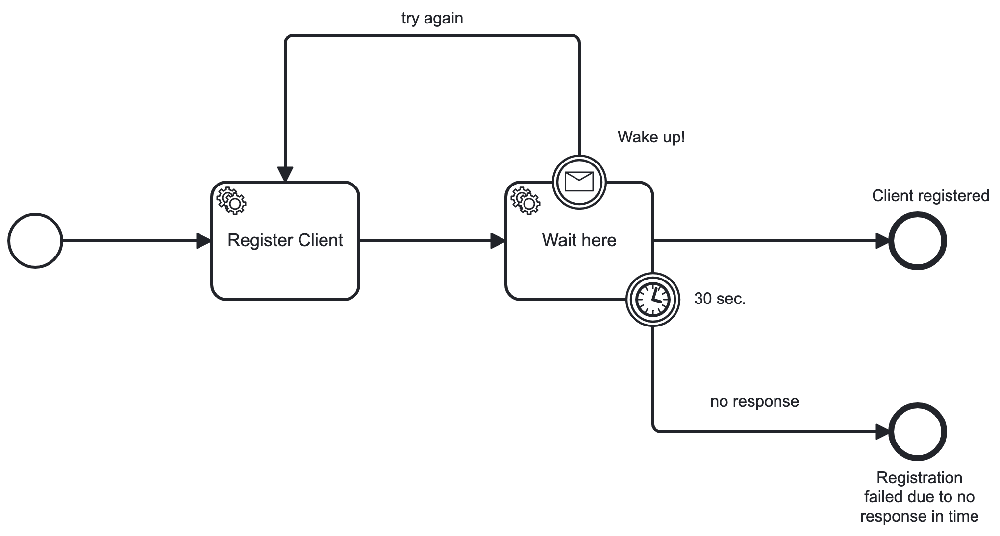

[](https://github.com/RobertVejvoda/dapr-zeebe-demo/actions/workflows/docker-image-net8-preview.yml)

# Dapr & Zeebe (Camunda) demo

Lets expose endpoints in web api and bind to Dapr Zeebe command and workers.



---

## Run

Ensure Camunda is running in Docker, skip to section Docker. Upload process model from Camunda Modeler: BPMN/underwriting-tester3.bpmn.

### Self hosted

Install Dapr and initialize in local environment: https://docs.dapr.io/getting-started/install-dapr-selfhost/

`dapr init`

Expected output:

- dapr_placement container is running.
- dapr_redis container is running.
- dapr_zipkin container is running.

If the placement service is not running, it can't bind zeebe and other components. This can happen if initialized via `dapr init -slim` command.

Run dapr dashboard (optional) on port 8090, because Camunda is already occupying default port 8080: `dapr dashboard -p 8090`

If port is already allocated, find process and kill:

```
lsof -i tcp:5056
kill 2309
```

In fact, only the placement service is needed here, so Dapr can be initialized as `dapt init --slim`.

---

### Docker

Ensure worker files in dapr/components folder use host.docker.internal instead of localhost. (zeebe-register-worker.yaml and zeebe-wait-here-worker.yaml).

1. Run Camunda components in camunda-platform folder: docker-compose-core.yaml: `docker compose -f docker-compose-core.yaml up -d`
2. Run app: `docker compose -f docker-compose.yaml up --build`

### Tests

Depends on how it's run, change host.docker.internal to localhost in dapr/components folder and run in terminal: `dotnet run`. Dapr is automatically attached to the process.

File requests.http contains REST client scripts and is perhaps better. I added a process version for each script as I believe it's a good rule.

Run app first: `dotnet run`

Run in another terminal - register client via invoking zeebe-command:

```
curl -v -H 'dapr-app-id: client-api' -H 'Content-Type: application/json' 'http://localhost:6199/api/clients/register' -d '{"ClientId": 1}'      
```

or

```
dapr invoke --app-id client-api --method api/clients/register -d '{"clientId": 1}'
```

### Test by invoking Zeebe commands

<b>topology</b>

```
curl -v -H 'Content-Type: application/json' -H 'dapr-app-id: client-api' \
http://localhost:6199/v1.0/bindings/zeebe-command \
-d '{ "operation": "topology" }'
```

<b>create-instance</b>

```
 curl -H 'Content-Type: application/json' -H 'dapr-app-id: client-api' \
http://localhost:6199/v1.0/bindings/zeebe-command \
-d '{ "operation": "create-instance", "data": {"bpmnProcessId": "UnderwritingTester3", "version": 3, "variables": {"clientId": 4} } }' 
```

Output:

```
{
  "processDefinitionKey":2251799813813845,
  "bpmnProcessId":"UnderwritingTester3",
  "version":3,
  "processInstanceKey":2251799813814448
}  
```

<b>set-variables</b>
```
curl -v -H 'Content-Type: application/json' -H 'dapr-app-id: client-api' \
http://localhost:6199/v1.0/bindings/zeebe-command -d '{ "operation": "set-variables", "data": { "elementInstanceKey": 2251799813814448, "variables": { "wait-message": "no time to wait!" } }, "metadata": { "test": "value" } }'
```

<b>publish-message</b>

```
curl -v -H 'Content-Type: application/json' -H 'dapr-app-id: client-api' \
http://localhost:6199/v1.0/bindings/zeebe-command -d '{ "operation": "publish-message", "data": { "messageName": "on-wait-here", "correlationKey": "4", "variables": { "wait-message": "no time to wait!" } } }'
```

<b>throw-error</b>

Error can be thrown only if worker is currently processing some task, therefore it's a job and we have a JobKey. Typically service tasks.

```
curl -H 'Content-Type: application/json' -H 'dapr-app-id: client-api' \ 
http://localhost:6199/v1.0/bindings/zeebe-command \
-d '{ "operation": "throw-error", "data": {"messageName": "wait-error", "jobKey": 2251799813814448 } }'
```


### Notes

Controller method MUST return a value. Returning void leads to JSON parse issue. It can be solved by returning empty object like NullResponse.

Content type MUST be specified in header: `curl -H "Content-Type: application-json" ...`

For running locally dapr-app-id must be specified in header: `curl -H "dapr-app-id: client-api" ...`

Return type of the message is passed back to global scope of Camunda variables:

```
result | "Client 3 registered."
```


### Builds and Deployments (updated on 1.7.2023)

I wanted to use multi-platform builds with GitHub actions, but QEMU emulator for ARM64 images doesn't seem to work properly with dotnet 7 images (and linux distributions)
After searching sources I found great source: https://devblogs.microsoft.com/dotnet/improving-multiplatform-container-support/ explaining added support for dotnet version 8 (in preview now, based on Alpine image) for multiple platforms for both build and buildx.

Two options:

1. Build, tag and deploy local images:

```
docker build . -f ClientAPI/Dockerfile -t client-api:linux-amd64 --platform linux/amd64      
docker build . -f ClientAPI/Dockerfile -t client-api:linux-arm64 --platform linux/arm64 

docker image tag client-api:linux-amd64 docker.io/robertvejvoda/dapr-zeebe-demo:linux-amd64
docker image push docker.io/robertvejvoda/dapr-zeebe-demo:linux-amd64 

docker image tag client-api:linux-arm64 docker.io/robertvejvoda/dapr-zeebe-demo:linux-arm64
docker image push docker.io/robertvejvoda/dapr-zeebe-demo:linux-arm64
```

2. Using buildx - just 1 command:

```
docker buildx build --pull --push -t docker.io/robertvejvoda/dapr-zeebe-demo -f ./ClientAPI/Dockerfile --platform linux/arm64,linux/arm,linux/amd64 . 
```


